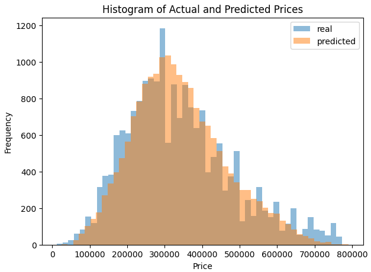

# XGBoost Regression Model for Price Prediction

## Description

This project implements a regression model using XGBoost to predict prices based on a dataset. 

XGBoost (Extreme Gradient Boosting) is a powerful machine learnin algorithm that provides state-of-the-art performance in regression and classification tasks. 

In this project, I use `XGBoost`  to train a model on a dataset and evaluate its performance with various metrics.

## Installation

To run this project, you need to have Python installed along with the necessary libraries. You can install the required libraries using pip. Ensure you

have `pandas`, `xgboost`, `scikit-learn`, and `numpy` installed.

## Usage

1. **Load the Dataset:**

   Ensure that the `last_data.csv` file is available in the working directory.

2. **Prepare the Data:**

   - **Separate Features and Target Variable:**
     ```python
     X = df.drop('price', axis=1)
     y = df['price']
     ```
   - **Split the Data into Training and Test Sets:**

     ```python
     X_train, X_test, y_train, y_test = train_test_split(X, y, test_size=0.2, random_state=42)
     ```

3. **Create and Train the Model:**

   - **Create the XGBoost Regression Model:**

     ```python
     xg_reg = xgb.XGBRegressor(objective='reg:squarederror', n_estimators=100, random_state=42)
     ```
   - **Train the Model with Training Data:**

     ```python
     xg_reg.fit(X_train, y_train)
     ```

4. **Make Predictions:**

   - **Use the Trained Model to Make Predictions on the Test Data:**

     ```python
     y_pred = xg_reg.predict(X_test)
     ```

5. **Evaluate the Model:**

   - **Check the Model's Performance:**

     ```python
     print("XGBoost R^2:", r2_score(y_test, y_pred))
     print("XGBoost MSE:", mean_squared_error(y_test, y_pred))
     print("XGBoost MAE:", mean_absolute_error(y_test, y_pred))
     ```


## Visuals



## Contributors

- **[Ezgi Tandogan](https://github.com/ezgitandogan)** 

## Timeline

` Setup and initial data handling` 

`Clean and prepare data for modeling` 

`Develop and train the model` 

`Optimize and evaluate the model` 

`Complete final checks and document the project.` 